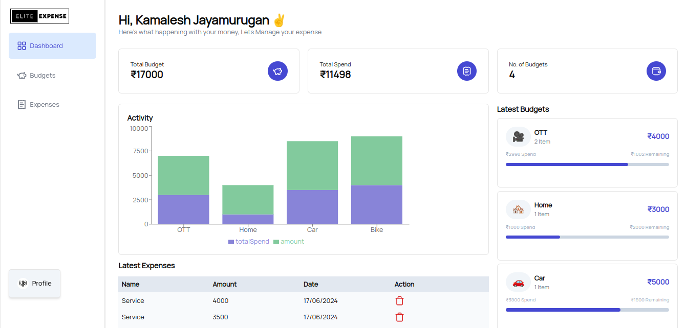

# ELITE EXPENSE 💸
Here's what happening with your money, Lets Manage your expense!!

## Technologies Used
- [**Next.js**](https://nextjs.org/): A React framework for server-rendered applications.
- [**Tailwind CSS**](https://tailwindcss.com/): A utility-first CSS framework for rapid UI development
- [**shadcn/ui**](https://ui.shadcn.com/) and [**HyperUI**](https://www.hyperui.dev/): Free Tailwind CSS UI components.
- [**Drizzle ORM**](https://orm.drizzle.team/): A Lightweight, serverless-ready Object-Relational Mapping (ORM) tool designed for TypeScript applications with feature rich SQL dialects.
- [**Neon Serverless Postgres**](https://neon.tech/): A serverless PostgreSQL database for scalable data storage.
- [**Clerk**](https://clerk.com/): A user authentication service for managing users and sessions.

## Preview


 ## Table of Contents

- [Prerequisites](#prerequisites)
- [Installation](#installation)
- [Configuration](#configuration)
- [Deploy on Vercel](#deploy-on-vercel)
- [Contributing](#contributing)
- [License](#license)

## Prerequisites

Before you begin, ensure you have the following prerequisites:

- Node.js and npm installed.
- Neon Postgres account for database storage.
- Clerk account for authentication.

## Installation

1. **Clone the repository:**
 ```bash  
git clone https://github.com/kamalj57/EliteExpense.git
  ```
2. **Install the necessary dependencies**
 ```bash
 npm install
```
3. **Run the development server**
```bash
npm run dev
# or
yarn dev
# or
pnpm dev
# or
bun dev
```
Open [http://localhost:3000](http://localhost:3000) with your browser to see the result.

4. **Push the schema to the Neon server**
``` bash
npm run db:push
```
5. **Run the Drizzle studio**
```bash
npm run db:studio
```

## Configuration

1. Create a `.env.local` file in the root directory.
2. Add the following environment variables
```env
NEXT_PUBLIC_CLERK_PUBLISHABLE_KEY = your NEXT_PUBLIC_CLERK_PUBLISHABLE_KEY
CLERK_SECRET_KEY= your CLERK_SECRET_KEY
NEXT_PUBLIC_CLERK_SIGN_IN_URL=/sign-in
NEXT_PUBLIC_CLERK_SIGN_UP_URL=/sign-up
NEXT_PUBLIC_DATABASE_URL= your neon database URL
```
## Deploy on Vercel 

The easiest way to deploy your Next.js app is to use the [Vercel Platform](https://vercel.com/new?utm_medium=default-template&filter=next.js&utm_source=create-next-app&utm_campaign=create-next-app-readme) from the creators of Next.js.

## Contributing

Contributions are welcome! Feel free to open issues and pull requests.

## License

This project is licensed under the MIT License.
Make sure to replace placeholder values (like `your NEXT_PUBLIC_CLERK_PUBLISHABLE_KEY`, `your CLERK_SECRET_KEY`, `your neon database URL`,) with your actual credentials.
